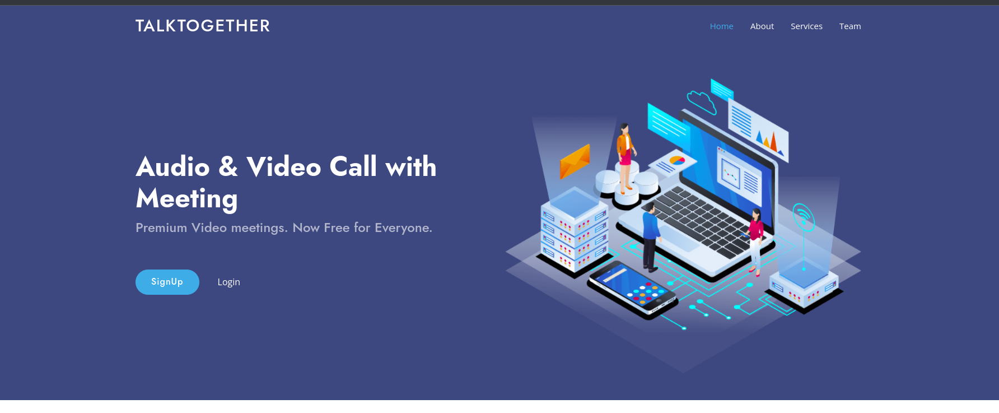

 

  

  <h3 align="center">TalkTogether</h3>

  

    TalkTogether Video Call App is a collaborative communication tool designed for developers and project contributors within the GitHub ecosystem.
     
     
  

      

## About The Project

TalkTogether Video Call App is a collaborative communication tool designed for developers and project contributors within the GitHub ecosystem. This application allows users to engage in real-time video calls, enabling efficient and seamless discussions, code reviews, pair programming, and remote collaboration.

Key Features:

Video Calls: The app provides a reliable and high-quality video call functionality, allowing participants to have face-to-face conversations and share screens to discuss code, troubleshoot issues, and provide feedback.

GitHub Integration: Built specifically for GitHub, the app seamlessly integrates with repositories, issues, and pull requests, allowing users to initiate video calls directly from relevant GitHub pages. This integration enhances productivity by eliminating the need to switch between different tools.

Collaboration Tools: TalkTogether offers additional collaboration features such as text chat, screen sharing, and real-time code editing, enabling participants to work together effectively regardless of their physical locations. These tools foster a collaborative environment and streamline the development process.

Privacy and Security: The app prioritizes privacy and security by providing end-to-end encryption for all video calls. This ensures that sensitive discussions and code sharing remain confidential and protected from unauthorized access.

Notification System: TalkTogether includes a notification system that alerts users about upcoming and ongoing video calls, ensuring that participants are aware of scheduled discussions and can join them promptly.

User-friendly Interface: The app offers an intuitive and user-friendly interface, making it easy for developers of all experience levels to navigate and utilize its features efficiently. The interface focuses on simplicity without compromising on functionality.

Cross-platform Compatibility: TalkTogether is available for major operating systems, including Windows, macOS, and Linux, ensuring broad accessibility for developers using different platforms.

## Built With

TalkTogether Video Call App is built using a combination of Django, CSS, JavaScript, and SQLite3 to create a robust and interactive web application.

## Getting Started

### Installation

Install Python and Django: Make sure you have Python installed on your system. You can download the latest version of Python from the official Python website (python.org). After installation, install Django by running the command pip install django in your command prompt or terminal.

Set up the Project: Create a new directory for your project and navigate to it using the command prompt or terminal. Use the following command to start a new Django project:

code:
django-admin startproject talktogether

This command will create a new Django project named "talktogether" in your current directory.

Create an App: Navigate to the project directory by running cd talktogether. Then, create a new Django app using the following command:
 code:
python manage.py startapp video_call
This command will create a new app named "video_call" within your project.

Define Models: Open the video_call/models.py file and define the necessary models for your application. Models represent the data structure of your app, such as users, video calls, participants, or any other entities you need.

Set up the Database: Django uses a database to store data. By default, Django uses SQLite3 as its database backend, which is suitable for development. Ensure that SQLite3 is installed on your system. Django will automatically create a SQLite3 database file based on the configuration in the settings.py file.

Migrate Database: Run the following command to apply the initial database migrations:

Copy code
python manage.py migrate
This command will create the necessary database tables based on your defined models.

Create Views and Templates: Views handle the logic for rendering templates and processing requests. Open the video_call/views.py file and define views for your application. Additionally, create HTML templates in the video_call/templates directory to define the structure and presentation of your app's pages.

Configure URLs: In the talktogether/urls.py file, define URL patterns to map incoming requests to the appropriate views you have created. This step ensures that the correct view is triggered for each URL.

Run the Development Server: Start the Django development server by running the following command:

Copy code
python manage.py runserver
This command will launch the server, and you can access your application by visiting http://localhost:8000 in your web browser.

## Usage

 TalkTogether Video Call App is designed to facilitate collaborative communication among developers and project contributors within the GitHub ecosystem. Here's how you can use the app effectively:

User Registration: Start by registering an account on the GitHub - TalkTogether Video Call App. This typically involves providing basic information and creating login credentials.

GitHub Integration: Connect your GitHub account with the TalkTogether app. This integration allows the app to access relevant project information, repositories, issues, and pull requests, enhancing collaboration within the GitHub environment.

Initiating a Video Call: Once logged in, you can initiate a video call by selecting the desired project or repository within your GitHub account. Look for options or buttons provided by the app to start a video call. This integration ensures that the video call is associated with the specific project, enabling seamless collaboration.

Inviting Participants: During the video call setup, you can invite other participants by sharing a unique link or generating an invitation. Participants can join the video call by clicking on the provided link. Depending on the app's features, you may be able to invite participants directly from your GitHub project or by sharing the invitation link through other communication channels.

Video Call Features: During the video call, you can take advantage of various features offered by the TalkTogether app. These features may include video and audio communication, screen sharing, real-time code editing, text chat, and more. Use these features to discuss code, review projects, provide feedback, or engage in pair programming sessions.

Collaboration and Communication: Leverage the app's capabilities to collaborate effectively with other participants. Utilize screen sharing to demonstrate code or troubleshoot issues together. Engage in live code editing to make real-time modifications and improvements. Utilize text chat to communicate additional details or share links during the video call.

Code Documentation and Notes: As you collaborate within the video call, you may want to document important discussions, decisions, or code changes. Take advantage of the app's functionality to capture and store relevant notes or annotations related to the project or specific code sections. This documentation can serve as a valuable reference for future work.

Exiting the Video Call: Once the video call concludes, you can exit the session. Depending on the app's features, you may have options to save any notes or changes made during the call. The app may also provide the ability to access call recordings or transcripts for future reference.

## Contributing

### Creating A Pull Request

Fork the Repository: If you haven't already, start by forking the repository you want to contribute to. Forking creates a copy of the original repository under your GitHub account.

Clone the Forked Repository: Clone the forked repository to your local machine using a Git client. This allows you to make changes to the code locally.

Create a New Branch: Create a new branch for your changes. It's recommended to use a descriptive branch name that reflects the purpose of your changes. Switch to the new branch before proceeding.

Make Changes: Make the necessary changes to the codebase in your local repository. This can include bug fixes, feature additions, or any other modifications relevant to your contribution.

Commit Changes: Once you've made the desired changes, commit them to your local repository. Use descriptive commit messages to explain the changes you've made.

Push Changes: Push your local branch with the committed changes to your forked repository on GitHub. This makes your changes accessible on the remote repository.

Create the Pull Request: Visit the original repository's page on GitHub. You should see a prompt to create a pull request (PR) from your recently pushed branch. Click on the "New pull request" button.

## License

Distributed under the MIT License. See [LICENSE](https://github.com/admin/talktogether/blob/main/LICENSE.md) for more information.

## Authors

* **Vishwanath Das** - *Full stack Developer* - [Vishwanath Das](https://github.com/vishwanathdas) - *Built Project Author in Github*

## Acknowledgements

* [Github](https://github.com/VishwanathDas)
* [Linkdin](https://www.linkedin.com/in/vishwanathdas/)
* [HackerRank]()
